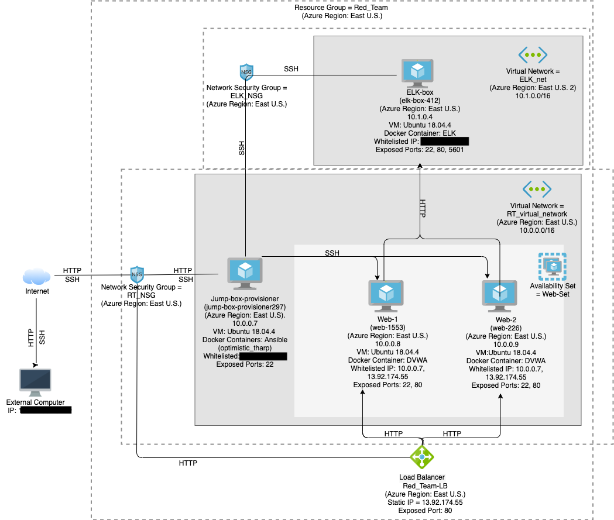
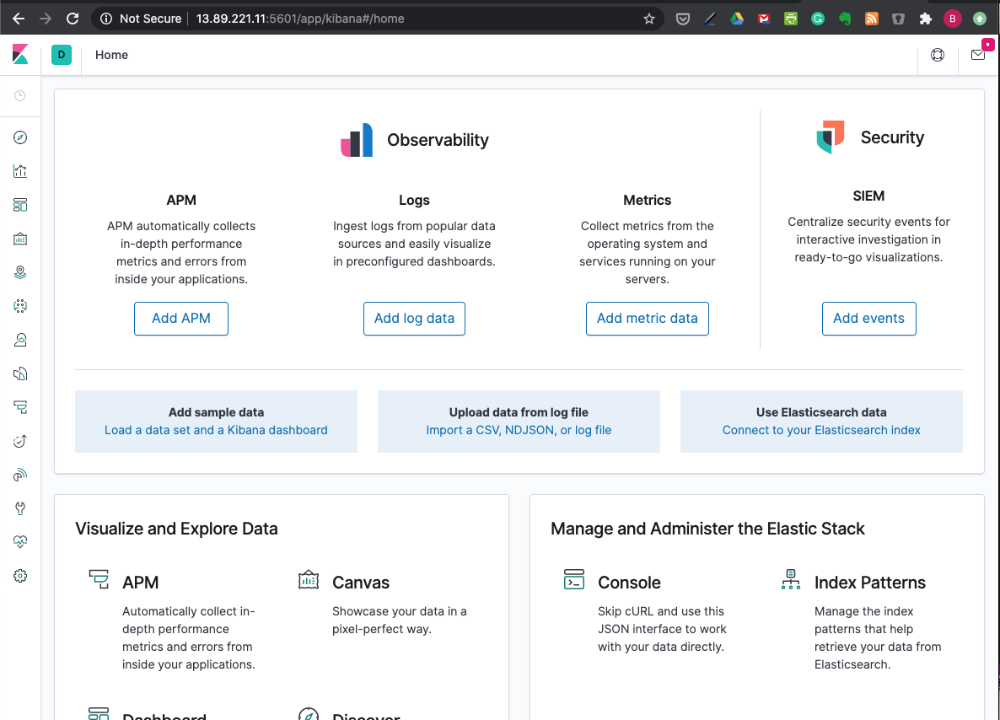
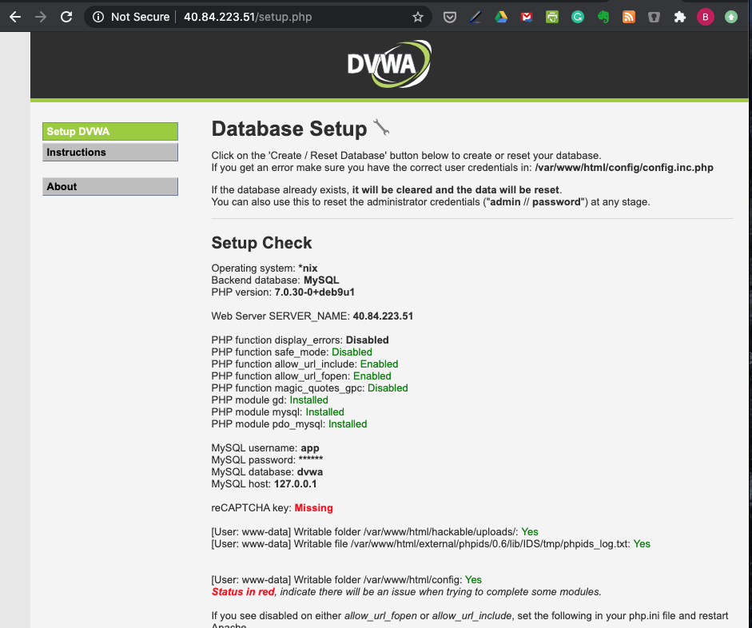
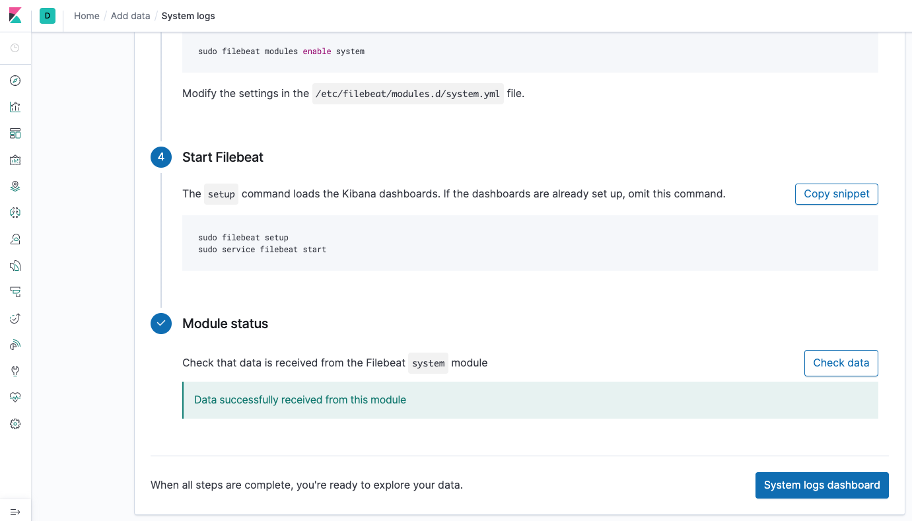
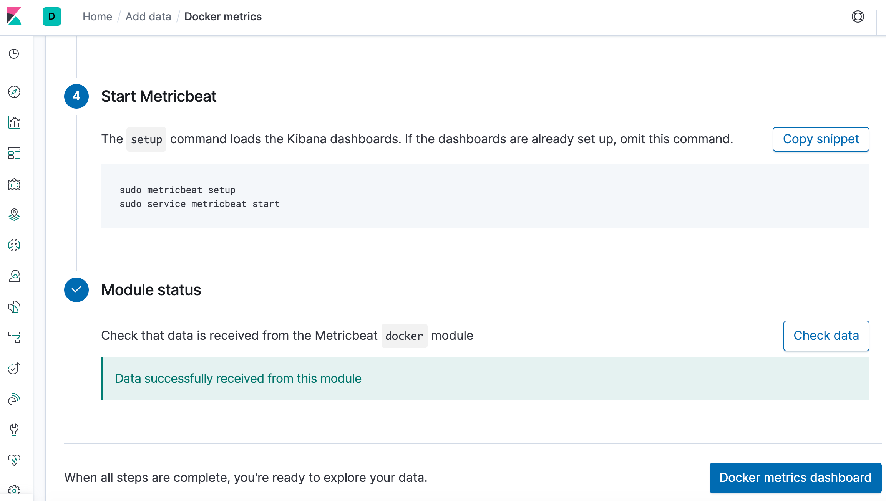

# Automated ELK Stack Deployment
## Elizabeth Johnson
---

The files in this repository were used to configure the network depicted below.

These files have been tested and used to generate a live ELK deployment on Azure. They can be used to either recreate the entire deployment pictured above. Alternatively, select portions of the .yml files may be used to install only certain pieces of it, such as Filebeat.

[dvwa.yml](Ansible/playbooks/dvwa.yml)

[install-elk.yml](Ansible/playbooks/install-elk.yml)

[filebeat_metricbeat_install.yml](Ansible/playbooks/Filebeat_metricbeat_install.yml)

This document contains the following details:
- Description of the Topology
- Access Policies
- ELK Configuration
  - Beats in Use
  - Machines Being Monitored
- How to Use the Ansible Build

### Description of the Topology

The main purpose of this network is to expose a load-balanced and monitored instance of DVWA, the Damn Vulnerable Web Application.

Load balancing ensures that the application will be highly available, in addition to restricting access to the network.

Load Balancers protect the availability of the website or network by ensuring the incoming web traffic is spread evenly among the working servers or systems.  Further, by utilizing a jump box we are creating another buffer between the servers and computers on our system and the outside internet.  In addition, it makes administering multiple machines more efficient, since one system can be used to manage the other systems.

Integrating an ELK server allows users to easily monitor the vulnerable VMs for changes to the event logs and system metrics.  In addition, having a seperate server collecting the logs and metrics means that users can access these logs even if the server suffers an outage.  
- Filebeat monitors log files or locations specified
- Metricbeat collects metrics and statistics for systems and services

The configuration details of each machine may be found below.

| Name                 | Function | IP Address | Operating System |
|----------------------|----------|------------|------------------|
| Jump-box-provisioner | Gateway  | 10.0.0.7   | Ubuntu 18.04.4   |
| Web-1                | Server   | 10.0.0.8   | Ubuntu 18.04.4   |
| Web-2                | Server   | 10.0.0.9   | Ubuntu 18.04.4   |
| ELK-Box              | ELK      | 10.1.0.4   | Ubuntu 18.04.4   |

### Access Policies

The machines on the internal network are not exposed to the public Internet. 

Only the Jump-box-provisioner machine and the load balancer can accept connections from the Internet. Access to the Jump-box-provisioner machine is only allowed from the following IP addresses: 
- `<ip address>`

Machines within the network can only be accessed by the Jump-box-provisioner ansible container.  In addition, the Load Balancer forwards port 80 TCP traffic to the web servers.
- The ELK VM can also be accessed by 108.87.95.162 for port 5601.

A summary of the access policies in place can be found in the table below.

|   Name                  |   Publicly Accessible  |   Allowed IP Addresses          |   Ports     |
|-------------------------|------------------------|---------------------------------|-------------|
|   Jump-box-provisioner  |   No                   |   xxx.xx.xx.xxx                 |   22        |
|   Load Balancer         |   Yes                  |   Open                          |   80        |
|   Web-1, Web-2          |   No                   |   13.92.174.55 (Load Balancer)  |   80        |
|   Web-1, Web-2          |   No                   |   10.0.0.7                      |   22        |
|   ELK-Box               |   No                   |   10.0.0.7                      |   22        |
|   ELK-Box               |   No                   |   xxx.xx.xx.xxx                 |   80, 5601  |

### Elk Configuration

Ansible was used to automate configuration of the ELK machine. No configuration was performed manually, which is advantageous because using Ansible to configure the ELK machine and servers makes the process easily replicable.

The playbook, install-elk.yml, implements the following tasks:
- Installs docker, python and the docker module.
- Increases the virtual memory on the VM that will run ELK.
- Downloads and launches the docker container for elk and launches it.

The following screenshot displays the result of running `docker ps` after successfully configuring the ELK instance.

### Target Machines & Beats

This ELK server is configured to monitor the following machines:
- 10.0.0.8
- 10.0.0.9

These machines were loaded with Docker and DVWA via dvwa.yml.

We have installed the following Beats on these machines:
- Filebeat
- Metricbeat

These Beats allow us to collect the following information from each machine:
- Filebeat collects log data and other specified data. E.g., kibana.log collects log data on the state of kibana.
- Metricbeat collects metrics and statistics on the system. E.g., system module monitors cpu, load, memory etc, which can be used to monitor how the system is running.

The playbook, Filebeat_metricbeat_install.yml, implements the following tasks:
- Downloads and installs Filebeat.
- Copies the Filebeat configuration file from Ansible to the target machine.
- Enables modules, setup and start Filebeat.
- Downloads and installs Metricbeat.
- Copies the Metricbeat configuration file from Ansible to the target machine.
- Enables modules, setup and start Metricbeat.

### Using the Playbooks

In order to use the playbooks, you will need to have an Ansible control node already configured. Assuming you have such a control node provisioned: 

To install the ELK server, SSH into the control node and follow the steps below:
- Copy the playbook, install-elk.yml, to /etc/ansible/roles.
- Update the /etc/ansible/hosts file to include the IP address for the elk server.
- Run the playbook, and navigate to http://<your_ELK_VM_Public_IP>:5601/app/kibana to check that the installation worked as expected. You should see: 

To install Docker, DVWA and beats packages on the webservers, SSH into the control node and follow these steps:
- Installing Docker and DVWA:
  - Copy the playbooks, dvwa.yml and filebeat_metricbeat_install.yml, to /etc/ansible/roles.
  - Update the /etc/ansible/hosts file to include the IP addresses for the webservers.
  - Run the playbook, dvwa.yml. 
  - To check that DVWA is working, visit <load balancer public IP>/setup.php in your web browser.  You should see: 

- Installing Filebeat and Metricbeat:
  - Use `cd` to enter your files directory, then use `curl https://github.com/bethwjohnson/portfolio/blob/master/Ansible/configuration_files/filebeat-configuration.yml > filebeat-configuration.yml` to save the file to the directory.
  - Update this file with <elk server private IP address> for hosts under "output.elasticsearch:" and under "setup.kibana".
  - Use `cd` to enter your files directory, then use `curl https://github.com/bethwjohnson/portfolio/blob/master/Ansible/configuration_files/metricbeat-configuration.yml > metricbeat-configuration.yml` to save the file to the directory.
  - Update this file with <elk server private IP address> for hosts under "output.elasticsearch:" and under "setup.kibana".
  - To check Filebeat is working, Click "Add log data" on the Kibana home page, then "System logs", then "Check Data".  You should see:
  - To check Metricbeat is working, Click "Add metric data" on the Kibana home page, then "Docker Metrics" then "Check Data". You should see:
  - For both steps, if you need to troubleshoot, make sure you are on "DEB" for the Getting Started instructions.
  
  [Back to Portfolio](https://github.com/bethwjohnson/portfolio)