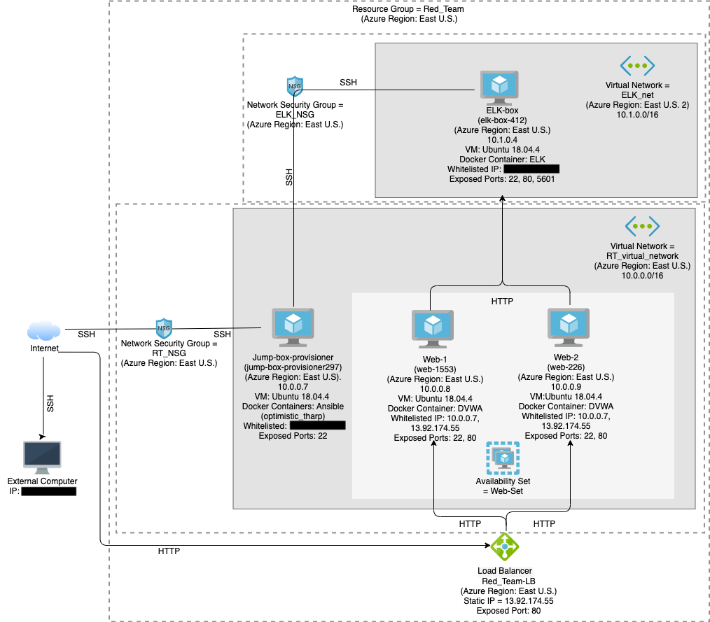

# Portfolio of Work
## Elizabeth Johnson

This portfolio is an example of the types of projects I've done, including:
- Linux scripting
- Ansible Deployments
  - Docker
  - DVWA
  - ELK
- Red and Blue Teaming

## Linux Bash Scripts

[roulette_dealer_finder_by_time.sh](Linux/roulette_dealer_finder_by_time.sh)

[roulette_dealer_finder_by_time_and_game.sh](Linux/roulette_dealer_finder_by_time_and_game.sh)

[system.sh](Linux/system.sh)

- Roulette Dealer scripts will search through a formatted data file to find information on the person scheduled to work at a certain time, or a certain time and game.

- System.sh saves to files the following system information:
  - free memory
  - disk usage
  - open files
  - file system disk space
This script can be automated by adding it to one of the cron directories.

## [Automated ELK Stack Deployment](ELK_Stack_Deployment/README.md)

The files in this repository were used to configure the network depicted below.

These files have been tested and used to generate a live ELK deployment on Azure. They can be used to either recreate the entire deployment pictured above. Alternatively, select portions of the .yml files may be used to install only certain pieces of it, such as Filebeat.

[dvwa.yml](ELK_Stack_Deployment/Ansible/playbooks/dvwa.yml)

[install-elk.yml](ELK_Stack_Deployment/Ansible/playbooks/install-elk.yml)

[filebeat_metricbeat_install.yml](ELK_Stack_Deployment/Ansible/playbooks/Filebeat_metricbeat_install.yml)

This document contains the following details:
- Description of the Topology
- Access Policies
- ELK Configuration
  - Beats in Use
  - Machines Being Monitored
- How to Use the Ansible Build

[View Project](ELK_Stack_Deployment/README.md)

## [Red v. Blue Team - Webserver](Project_Red_v_Blue_Webserver/README.md)

A Red Team and Blue Team exploration of a WordPress Webserver utilizing:
Red Team: Kali Linux, WPScan, Nmap, Metasploit, including custom exploits with MSFvenom, Meterpreter and MSFconsole.
Blue Team: ELK Stack solution utilizing:
- Filebeat
- Metricbeat
- Packetbeat
- Kibana
- Watcher

[View Project](Project_Red_v_Blue_Webserver/README.md)
